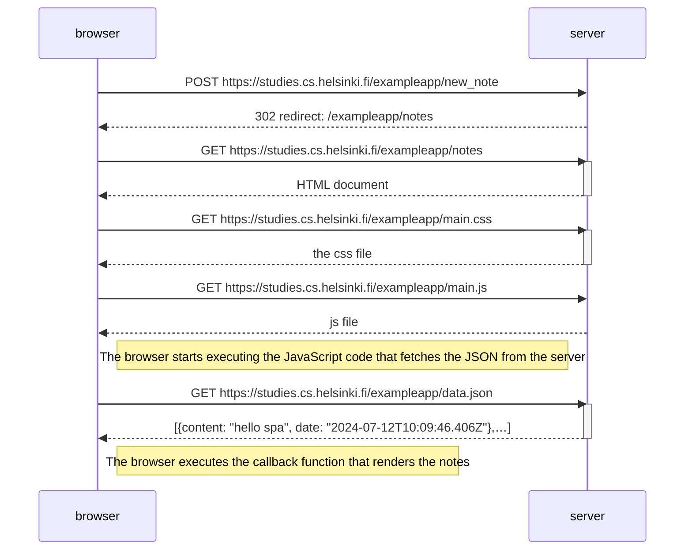

```mermaid
sequenceDiagram
  browser->>server: POST https://studies.cs.helsinki.fi/exampleapp/new_note
  server-->>browser: 302 redirect: /exampleapp/notes
  browser->>server: GET https://studies.cs.helsinki.fi/exampleapp/notes
  activate server
  server-->>browser: HTML document
  deactivate server
  browser->>server: GET https://studies.cs.helsinki.fi/exampleapp/main.css
  activate server
  server-->>browser: the css file
  deactivate server
  browser->>server: GET https://studies.cs.helsinki.fi/exampleapp/main.js
  server-->>browser: js file
  Note right of browser: The browser starts executing the JavaScript code that fetches the JSON from the server
  browser->>server: GET https://studies.cs.helsinki.fi/exampleapp/data.json
  activate server
  server-->>browser: [{content: "hello spa", date: "2024-07-12T10:09:46.406Z"},…]
  deactivate server
  Note right of browser: The browser executes the callback function that renders the notes
```