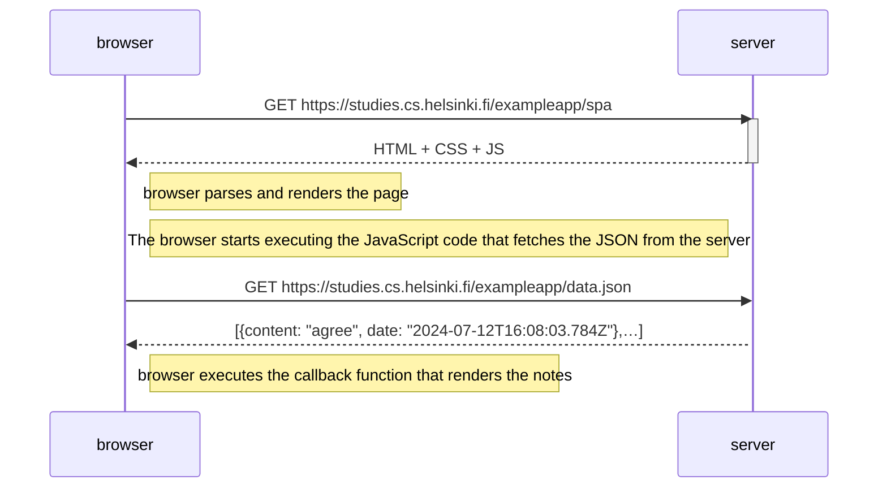

```mermaid  
sequenceDiagram
    participant browser
    participant server
    
    browser->>server:GET https://studies.cs.helsinki.fi/exampleapp/spa
    activate server
    server-->>browser:HTML + CSS + JS
    deactivate server
note right of browser:browser parses and renders the page
note right of browser:The browser starts executing the JavaScript code that fetches the JSON from the server
    browser->>server:GET https://studies.cs.helsinki.fi/exampleapp/data.json
    activate server
    server-->>browser:[{content: "agree", date: "2024-07-12T16:08:03.784Z"},…]
note right of browser:browser executes the callback function that renders the notes


```